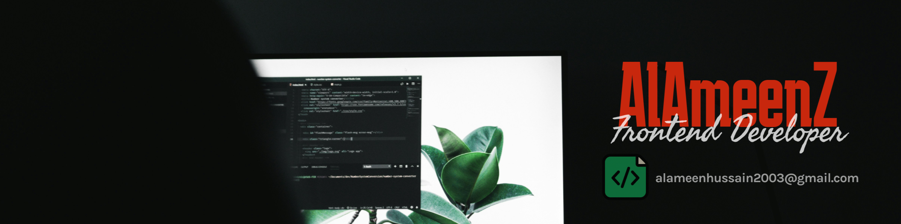

  

  

  

<b>Hello, I'm Ameen</b> 

- 🔭 Currently building full-stack projects
- 🌱 Learning system design & backend optimization
- 🧠 Interested in performance, clean code, and security
- 📫 Reach me at: alameenhussain2003@gmail.com

  

 
 <h2 align="center">🛠 Tech Stack</h2> 
<picture>
  <source media="(prefers-color-scheme: dark)" srcset="./Skills_Animation_Dark.gif">
  <source media="(prefers-color-scheme: light)" srcset="./Skills_Animation_White.gif">
  
</picture>
 
<h4 align="left">- Frontend: HTML, CSS, JavaScript, React</h4>
<h3 align="left">CURRENTLY LEARNING</h3>
<ul align="left">
  <li>Backend: Node.js, Express</li>
  <li>Database: MongoDB, MySQL</li>
  <li>Tools: Git, GitHub, VS Code</li>
</ul>

